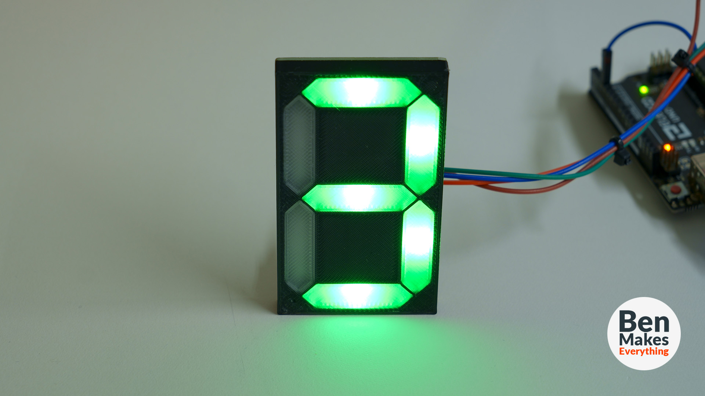

# 3D Printable 7 Segment Display
### This is a fully 3D printed segmented display designed for use with custom PCBs

# Parts list - for 1 display
* (7) WS2812B SMT LED
* (7) 0.1uF SMT capacitor
* (2) 1x3 male pin headers
* (1) PCB
* (4) M3 heat-set threaded inserts

All of the 3D files are available in .stl and .step format in the "Objects" folder.

The Arduino code for this version is available in the "Code" folder. It requires that you install the Adafruit neopixel libary within the Arduino IDE. 

In the "PCBs" folder you will find 2 zip files. 7-Segment-THT-KiCad.zip is a zipped folder of everything you need to open this in KiCad version 8+. 7-Segment-THT.kicad_pcb.zip contains gerber/drill files.
